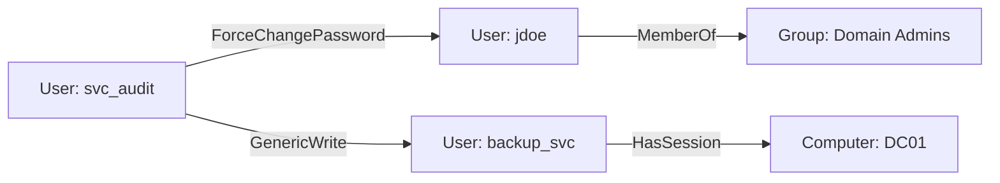

# Lantern Architecture

This document describes the architecture of **Lantern** (codename for ACLGuard's next generation) and the current C implementation it is being rewritten from.

Two layers are documented:

1. **Current C baseline** (v2.0.0 "Purple") — what ships today, preserved as the working implementation while the rewrite lands.
2. **Lantern Go target** — the planned architecture: project layout, graph model, CLI/TUI surface, and integration contracts.

Everything under the "Lantern" heading is the target design; nothing in this section exists in the tree yet.

---

## 1. Current C Baseline

### 1.1 Layout

```
src/
├── main.c              # Entry point, CLI parsing, legacy export flags
├── ldap.c              # LDAP connectivity, user enumeration, permission analysis
├── ldap_insights.c     # Subcommand output: status, alerts, correlate, analyze, metrics
├── config.c            # Environment-variable configuration
├── export.c            # CSV/JSON export
├── error_handler.c     # Centralized error handling
└── mock.c              # Offline mock data for --mock mode

include/
├── types.h             # ADUser struct, permission flags, MITRE fields
├── config.h            # Config struct + env var names + version macros
├── aclguard_ldap.h     # LDAP function declarations
├── export.h            # Export declarations
├── error_handler.h     # Error declarations
├── ldap_insights.h     # Subcommand output declarations
└── mock.h              # Mock data declarations

tests/                  # smoke_test.sh (mock), ldap_smoke_test.sh (live), test_runner
scripts/                # demo_mock.sh, simulate_kerberoasting.py
data/mock/              # Mock fixtures
```

### 1.2 Data flow

```mermaid
flowchart LR
    Env[Environment config\nACLGUARD_*] --> Main[main.c]
    Main --> LDAP[ldap.c\nfetch_real_users]
    LDAP --> AD[(Active Directory\nover LDAP)]
    LDAP --> Users[ADUser[]]
    Users --> Insights[ldap_insights.c\nstatus / alerts / correlate / analyze / metrics]
    Users --> Export[export.c\nCSV / JSON]
    Insights --> Stdout[Terminal / JSON]
    Mock[mock.c] -. --mock mode .-> Users
```

### 1.3 Core data structure (`ADUser`)

```c
typedef struct {
    char *username;   // sAMAccountName
    char *cn;         // Common Name
    char *dn;         // Distinguished Name
    char *mail;       // Email
    char *memberOf;   // Group memberships (comma-separated DNs)

    struct {
        int isAdmin;           // Domain/Enterprise Admin membership
        int canResetPasswords; // Password reset permission
        int canModifyACLs;     // WriteDACL permission
        int canDelegateAuth;   // Authentication delegation
        int hasServiceAcct;    // Service account privileges
        int isPrivileged;      // Any privileged membership
        int canReadSecrets;    // Read sensitive attributes
        int canWriteSecrets;   // Write sensitive attributes
    } perms;

    int risk;              // Risk score 0-100
    char *mitre_attack;    // Primary MITRE ATT&CK technique ID
    char *mitre_name;      // Human-readable technique name
} ADUser;
```

### 1.4 Analysis model

Analysis is **group-membership based**: permission flags derive from matching group names against known high-risk groups, then a weighted risk score is computed (admin +40, write secrets +35, delegation +30, password reset +25, read secrets +20, ACL modify +20, service account +15; capped at 100). No raw DACL/ACE parsing. Direct memberships only — no transitive resolution.

### 1.5 Build

`Makefile` with `gcc -Wall -Wextra -pedantic -O2`, linked against `-lldap -llber -ljson-c`. Targets: `all` (binary), `clean`, `test` (runs both smoke scripts).

---

## 2. Lantern Go Target

### 2.1 Goals

- Single static Go binary, stdlib-first; exactly one external dependency (LDAP client: `go-ldap/ldap/v3`).
- **Composable pipeline**: collect → graph → analyze → emit as separate internal packages, exposed as a common `pipeline` contract so stages can be swapped or reordered.
- Two surfaces over one core: scriptable **CLI** and interactive **TUI**.
- Deterministic, diffable output; same input → same bytes.

### 2.2 Planned project structure

```
lantern/
├── cmd/
│   ├── lantern/            # CLI entry point (cobra or stdlib flag)
│   └── lantern-tui/        # TUI entry point (bubbletea)
├── internal/
│   ├── collect/            # LDAP collection (users, groups, computers, OUs)
│   ├── graph/              # In-memory permission graph (nodes + typed edges)
│   ├── analyze/            # Risk scoring, path analysis, MITRE mapping
│   ├── output/             # JSON / CSV / text emitters
│   ├── config/             # env vars + optional config file
│   └── pipeline/           # stage wiring contract
├── pkg/
│   └── graph/              # Public graph types (importable by integrations)
├── testdata/               # LDIF fixtures for offline tests
├── go.mod
└── Makefile                # thin wrapper over go build/test/vet
```

### 2.3 Graph model

A directed property graph, BloodHound-inspired but deliberately smaller. Only edges that matter for abuse paths are modeled.

**Nodes**

| Kind | Represents | Key attributes |
|------|-----------|----------------|
| `User` | AD user principal | sAMAccountName, SID, enabled, adminCount |
| `Group` | AD group | sAMAccountName, SID, groupType |
| `Computer` | AD machine | dNSHostName, operatingSystem |
| `OU` | Organizational unit | distinguishedName |

**Edges** (directed, typed)

| Edge | Semantics | Abuse potential |
|------|-----------|-----------------|
| `MemberOf` | principal → group | privilege inheritance |
| `ForceChangePassword` | user → user | account takeover |
| `GenericAll` | principal → principal | full object control |
| `GenericWrite` | principal → principal | attribute/ACL manipulation |
| `WriteDacl` | principal → object | grant self any right |
| `WriteOwner` | principal → object | take ownership, then WriteDacl |
| `AllExtendedRights` | principal → object | reset password, modify membership |
| `HasSession` | user → computer | credential access (BloodHound-style) |

The graph is **in-memory** for a single scan (no database), with optional JSON graph export so external tooling can persist or query it.



### 2.4 CLI contract (target)

```
lantern collect --uri ldap://dc01:389 --base-dn DC=corp,DC=local [--out graph.json]
lantern graph --in graph.json query "MemberOf->Group(name=Domain Admins)"
lantern audit [--risk-threshold 60] [--format json|csv|text]
lantern serve --in graph.json            # local HTTP/JSON API for tooling
```

Design rules:

- Every command reads **stdin or a file** and writes **stdout or a file** — no hidden state.
- `--format json` output must be stable: fixed field order, no timestamps unless `--timestamp` is passed (diff-friendly).
- Exit codes: `0` ok, `1` runtime error, `2` usage error, `3` risk threshold exceeded (for CI gates).
- Mock mode persists: `--mock` with `testdata/` LDIF fixtures, identical contract to live mode.

### 2.5 TUI (target)

Terminal-native graph exploration (Bubble Tea):

- **Tree/list view**: users, groups, computers — filter, sort by risk.
- **Graph view**: adjacency of the selected node's inbound/outbound edges.
- **Path view**: shortest abuse path between two principals (BFS over edges).
- Keys: `j/k` navigate, `Enter` expand, `p` path mode, `/` filter, `q` quit. All views render from the same `internal/graph` model.

### 2.6 Integration contracts

| Contract | Shape | Consumers |
|----------|-------|-----------|
| JSON findings | array of `Finding` objects, stable schema | CI gates, SIEM, harness pipelines |
| CSV findings | same fields, escaped | spreadsheets, compliance evidence |
| JSON graph | nodes + typed edges | research tooling, path queries |
| MITRE mapping | `technique_id` + `technique_name` per finding | detection engineering, security-research |
| Exit codes | 0/1/2/3 | CI/CD gates |
| Audit event | one JSON line per scan to stdout | NightForge harness collector |

**Finding schema (target):**

```json
{
  "principal": "jdoe",
  "principal_type": "User",
  "finding": "MemberOf Domain Admins",
  "edge": {"type": "MemberOf", "target": "Group:Domain Admins"},
  "risk": 90,
  "technique_id": "T1078.002",
  "technique_name": "Valid Accounts: Domain Accounts"
}
```

### 2.7 Security posture of the target

- **Read-only LDAP**: bind with a read-only account; no writes ever issued.
- **LDAPS/GSSAPI by default**; plain `ldap://` requires explicit `--insecure` (or refused).
- Credentials only via env var / config file with `0600` perms; never on the command line (visible in `ps`).
- Engagement data boundary: findings and graph exports are treated as sensitive AD data — see [SECURITY.md](SECURITY.md).

---

## 3. Migration path

| Step | Deliverable | Dependency |
|------|-------------|-----------|
| 1 | `internal/collect` LDAP → `[]User` (replaces `ldap.c`) | go-ldap client |
| 2 | `internal/graph` build nodes/edges from collected data | step 1 |
| 3 | `internal/analyze` port risk scoring + MITRE mapping | steps 1–2 |
| 4 | CLI subcommands match current C contract (drop-in) | steps 1–3 |
| 5 | Graph export + `lantern graph query` | step 2 |
| 6 | TUI (`lantern-tui`) | step 5 |
| 7 | `lantern serve` HTTP API | step 5 |

The C binary remains the supported baseline until step 4 lands and passes the same smoke tests.
