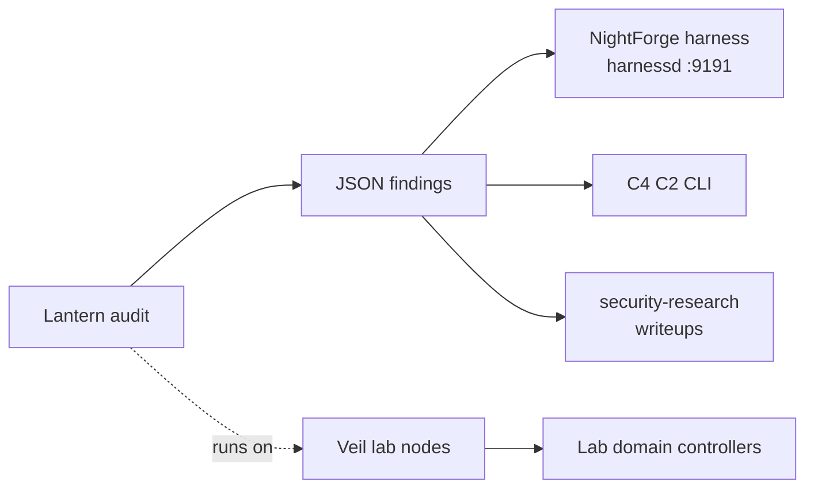

# Integration Targets

How Lantern (ACLGuard) fits into the surrounding CR1MS0N Security / Azrael Security infrastructure. Facts about each target are verified against the respective repositories; Lantern-side integration points are **planned** unless marked otherwise.

## Overview



## NightForge harness (`harnessd`)

**What it is.** NightForge is the operator workstation (Arch Linux + Niri), hosting the `harnessd` monitoring dashboard — a stdlib-only Go daemon on `127.0.0.1:9191` (`nightforge` repo, `cmd/harnessd/`). It serves a 10-layer harness model (L4 health, L5 proposals, L6 gates, L7 snapshots, L8 routes, cost/tokens) with JSONL persistence in `data/` and a systemd user service.

**Integration contract (planned).**

- Scheduled Lantern audits emit JSON findings; a collector posts the scan summary to the harness health layer (or the harness pipeline script consumes the findings file directly, mirroring `scripts/harness/*.sh` input conventions).
- **Drift detection**: Lantern exports are deterministic and diffable; a nightly run diffed against the previous export feeds L5 proposals ("permission drift detected: 3 new Domain Admin memberships") and L6 gate checks (fail the gate above a risk threshold).
- Alignment: harnessd is Go + JSONL; Lantern is Go + stable JSON. Contract is a findings JSON file plus optional `POST /api/v1/...` ingestion.

**Data flow (planned):**

```text
cron: lantern audit --format json > data/audit/YYYY-MM-DD.json
      scripts/harness/failure-miner.sh  (or new drift-miner) → L5/L6 layers
```

## C4 — C2 Control Center

**What it is.** A Go CLI (`c4`, `github.com/CR1MS0N-Operator/c4`) that deploys, configures, and tears down C2 frameworks (Mythic, Sliver) via GraphQL (Hasura) and Docker Compose. Go 1.26+. It is the C2 **validation engine** of the CR1MS0N continuous adversarial validation platform.

**Integration contract (planned).**

- Lantern provides pre-engagement AD reconnaissance for C2 operations planning: operators on Tairn (attack node) run Lantern against the target domain before deploying C2, mapping privileged accounts and credential-bearing service principals.
- Output feeds operational decisions: which accounts are Kerberoastable (T1558.003 findings), which are Domain Admins, which paths lead to the domain from a foothold.
- No code coupling required — findings JSON is the handoff artifact.

## Veil — offensive security infrastructure

**What it is.** CR1MS0N Security's production offensive-security homelab: a WireGuard hub-and-spoke mesh connecting Cerberus (edge node, `10.10.10.1`), NightForge (workstation, `10.10.10.3`), Tairn (attack node with Mythic C2, `10.10.10.4`), Hermes (redirector, `10.10.10.5`), and the operator's iPhone. No node is directly reachable from WAN.

**Integration contract (planned).**

- **Deployment**: Lantern builds and runs from NightForge (operator) or Tairn (attack node) against lab domain controllers inside the lab network.
- **Scope**: scans target lab AD only, through the WireGuard mesh; results stay on the engaging node per the [SECURITY.md](../SECURITY.md) data boundary.
- **Read-only posture**: a dedicated read-only bind account on the lab domain, never Domain Admin credentials.

## security-research (Azrael Security)

**What it is.** The Azrael Security research repo (`security-research`) documents original offensive security research with a five-phase methodology (baseline establishment, boundary identification, deviation testing, impact mapping, documentation) and MITRE ATT&CK mapping.

**Integration contract (planned).**

- Lantern findings feed research writeups: MITRE-mapped permission findings (T1078.002, T1098, T1484, T1484.001, T1552, T1558.003) are reproducible evidence for detection engineering and AD abuse-path research.
- The graph export (nodes + edges) supports path-analysis research: shortest abuse paths, nested group inheritance, privilege escalation chains.
- Anonymization applies: any finding published to security-research must have DNs, usernames, and domain names replaced with placeholders (see [SECURITY.md](../SECURITY.md)).

## Contract summary

| Target | Repo | Interface | Status |
|--------|------|-----------|--------|
| NightForge harness | `nightforge` | Findings JSON → harness layers/JSONL | Planned |
| C4 | `c4` | Findings JSON as recon handoff | Planned |
| Veil | `veil` | Runs on NightForge/Tairn vs lab AD | Planned |
| security-research | `security-research` | MITRE-mapped findings, anonymized | Planned |
